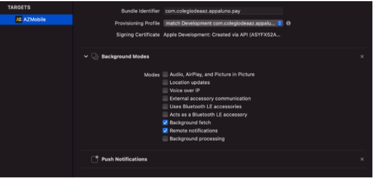
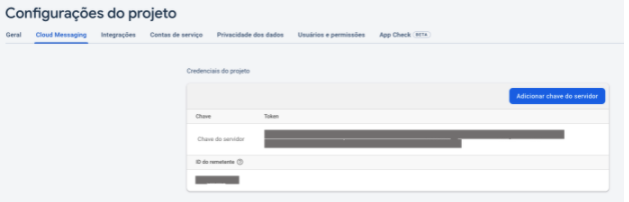
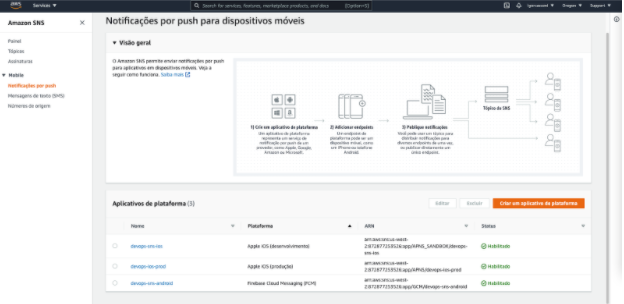
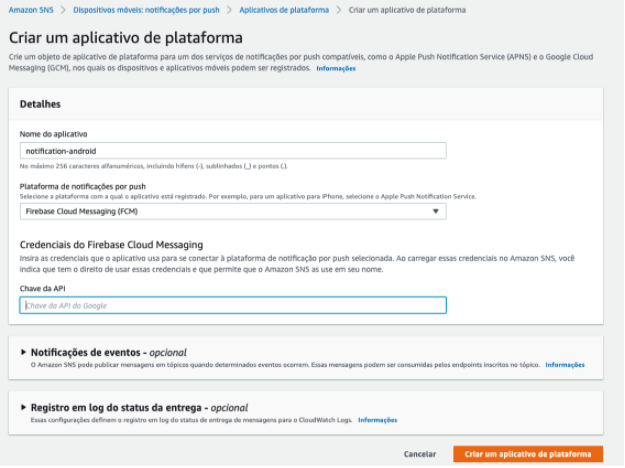
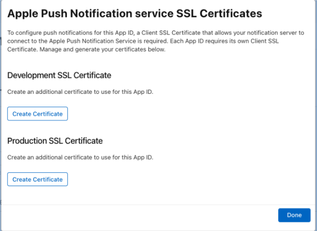
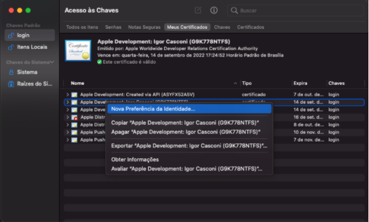
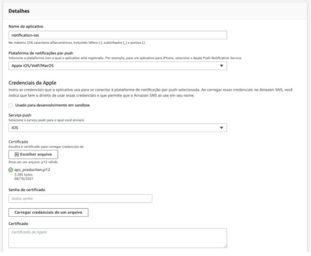

# Push Notification com Amazon SNS

## Introdução

&nbsp;&nbsp;&nbsp;&nbsp;&nbsp; A configuração de bibliotecas de Push Notification em contato com a Amazon SNS, utilizando um SDK no back-end para realizar disparo de notificações remotas para o dispositivo Android e iOS. Essa documentação visa explicar além da configuração, alguns pontos que não estão tão bem explicados ou fácil de encontrar pesquisando na internet. Abaixo segue dividido em tópicos a configuração do Android e iOS e como realizar a configuração na Amazon para um simples disparo de uma notificação remota.

## Instalações das bibliotecas para React Native

Para começar com o push notification no aplicativo feito com React Native, será necessário a instalação de duas bibliotecas, uma para android e a outra para iOS.

Para essa documentação foi utilizada as seguintes versões de bibliotecas:

- RN: v0.61.5
- [zoOr/react-native-push-notification](https://github.com/zo0r/react-native-push-notification): v7.4.0
- [react-native-community/push-notification-ios](https://github.com/react-native-push-notification/ios): v1.10.1

### Download das bibliotecas

#### Android

```shell
yarn add react-native-push-notification
```

#### iOS

```shell
yarn add @react-native-community/push-notification-ios
```

## Configuração da biblioteca no Android

No arquivo `AndroidManifest.xml` dentro da pasta `android`, adiciona as seguintes linhas para habilitar permissões para o aplicativo e vincular os módulos da biblioteca `react-native-push-notification`:

```xml
<!-- android/app/src/main/AndroidManifest.xml -->
...
<!-- adiciona as duas linhas abaixo fora do application -->
<uses-permission android:name="android.permission.VIBRATE" />
<uses-permission android:name="android.permission.RECEIVE_BOOT_COMPLETED"/>
…
<application ...>
<!-- dentro do application adicione as linhas abaixo -->
 <meta-data android:name="com.dieam.reactnativepushnotification.notification_foreground" android:value="true"/>
 <meta-data android:name="com.dieam.reactnativepushnotification.channel_create_default" android:value="false"/>
 <receiver android:name="com.dieam.reactnativepushnotification.modules.RNPushNotificationActions" />
 <receiver android:name="com.dieam.reactnativepushnotification.modules.RNPushNotificationPublisher" />
 <receiver android:name="com.dieam.reactnativepushnotification.modules.RNPushNotificationBootEventReceiver">
   <intent-filter>
     <action android:name="android.intent.action.BOOT_COMPLETED" />
     <action android:name="android.intent.action.QUICKBOOT_POWERON" />
     <action android:name="com.htc.intent.action.QUICKBOOT_POWERON"/>
   </intent-filter>
 </receiver>
 <service android:name="com.dieam.reactnativepushnotification.modules.RNPushNotificationListenerService" android:exported="false" >
  <intent-filter>
   <action android:name="com.google.firebase.MESSAGING_EVENT" />
  </intent-filter>
 </service>
...
```

Agora é necessário adicionar nas configurações do android o link com os arquivos da `node_modules`, isso dá para fazer com autolink do `react-native link` ou manualmente para funcionar corretamente o Push Notification:

```javascript
// android/settings.gradle
...
include ':react-native-push-notification'
project(':react-native-push-notification').projectDir = file('../node_modules/react-native-push-notification/android')
```

E para o arquivo android/app/build.gradle a implementação da biblioteca:

```javascript
// android/app/build.gradle
dependencies {
  ...
  implementation project(':react-native-push-notification')
  ...
}
```

Importe o pacote da biblioteca dentro do arquivo `MainApplication.java`, no final da linha de import's:

```javascript
// MainApplication.java
...
import com.dieam.reactnativepushnotification.ReactNativePushNotificationPackage;
```

### Configuração para notificações remotas

Para o disparo de notificações remotas, é necessário que o dispositivo se comunique com o firebase. Basta ter realizado a configuração inicial do Firebase. Isso pode ser validado com as suas configurações com este link: [react-native-push-notification#if-you-use-remote-notifications](https://github.com/zo0r/react-native-push-notification#if-you-use-remote-notifications)

## Configuração da biblioteca no iOS

Com iOS, para a versão do RN >= 0.60, também funciona com o autolink, mas caso queira realizar manualmente ou está em versões do RN anteriores a 0.60, rode o comando abaixo:

```shell
react-native link @react-native-community/push-notification-ios
```

Agora na pasta iOS dentro do seu projeto, é preciso adicionar métodos nativos para o suporte de notificações acontecer dentro do RN, primeiro no arquivo `AppDelegate.h`:

```javascript
// AppDelegate.h
...
// Adicione o import abaixo no final do import's
#import <UserNotifications/UNUserNotificationCenter.h>

// altere a linha com @interface para a linha abaixo:
@interface AppDelegate : UIResponder <UIApplicationDelegate, RCTBridgeDelegate, UNUserNotificationCenterDelegate>

```

No arquivo `AppDelegate.m` adicione os import's no topo do arquivo:

```javascript
// AppDelegate.m
#import <UserNotifications/UserNotifications.h>
#import <RNCPushNotificationIOS.h>

```

Dentro do escopo do `application didFinishLaunchingWithOptions` antes do `return Yes;` adicionar a seguinte linha explicitá com o comentário:

```javascript
// AppDelegate.m
- (BOOL)application:(UIApplication *)application didFinishLaunchingWithOptions:(NSDictionary *)launchOptions
{
  ...
  // Adicione esta duas linhas abaixo: UNUserNotificationCenter
  UNUserNotificationCenter *center = [UNUserNotificationCenter currentNotificationCenter];
  center.delegate = self;

  return YES;
}

```

Adicionar a função abaixo para receber a notificações em primeiro plano:

```javascript
// AppDelegate.m
-(void)userNotificationCenter:(UNUserNotificationCenter *)center willPresentNotification:(UNNotification *)notification withCompletionHandler:(void (^)(UNNotificationPresentationOptions options))completionHandler
{
  completionHandler(UNNotificationPresentationOptionSound |  UNNotificationPresentationOptionAlert | UNNotificationPresentationOptionBadge);
}

```

E para finalizar a configuração dentro do arquivo `AppDelegate.m`, antes da função `- (NSURL *)sourceURLForBridge:(RCTBridge *)bridge`, adicionar todo o código abaixo, para funcionar o registro do token do dispositivo e para notificações locais:

```javascript
// AppDelegate.m
- (void)application:(UIApplication *)application didRegisterForRemoteNotificationsWithDeviceToken:(NSData *)deviceToken
{
 [RNCPushNotificationIOS didRegisterForRemoteNotificationsWithDeviceToken:deviceToken];
}
- (void)application:(UIApplication *)application didReceiveRemoteNotification:(NSDictionary *)userInfo
fetchCompletionHandler:(void (^)(UIBackgroundFetchResult))completionHandler
{
  [RNCPushNotificationIOS didReceiveRemoteNotification:userInfo fetchCompletionHandler:completionHandler];
}
- (void)application:(UIApplication *)application didFailToRegisterForRemoteNotificationsWithError:(NSError *)error
{
 [RNCPushNotificationIOS didFailToRegisterForRemoteNotificationsWithError:error];
}
- (void)userNotificationCenter:(UNUserNotificationCenter *)center
didReceiveNotificationResponse:(UNNotificationResponse *)response
  withCompletionHandler:(void (^)(void))completionHandler
{
  [RNCPushNotificationIOS didReceiveNotificationResponse:response];
}

```

Arquivos configurados para o iOS, então agora é preciso adicionar o Capabilities para o dispositivo, abra o XCode com o seu workspace, e em target, vá em `+ Capability`, adicione o Push Notifications e Background Modes (com as opções: Remote Notifications e Background Fetch).



## Ícones para as notificações

> **AVISO**: iOS não será necessário nenhuma configuração a mais com o push notification, ele já coloca o próprio ícone do aplicativo

Para configurar no android é preciso entender que os ícones precisam ser totalmente brancos e com detalhes em transparência, de acordo com a documentação do Android, com a cor selecionada no arquivo `AndroidManifest.xml`, igual a linha de código abaixo, cor esta cor selecionado ela atinge os pixels brancos, para entender melhor leia a issue da biblioteca do push notification e/ou a regras de ícones da Material Design:

- [React-native-push-notification #issue Icons](https://github.com/zo0r/react-native-push-notification/issues/730#issuecomment-389545259)
- [Material Design - Design Principles](https://material.io/design/iconography/product-icons.html#design-principles)

A cor deverá ser adicionado em `colors.xml` na pasta `res/values`, caso não exista esse arquivo, deverá ser criado no mesmo caminho informado:

```xml
<!-- android/app/src/values/colors.xml -->
<?xml version="1.0" encoding="utf-8"?>
<resources>
 <color name="colorNotification">#000000</color>
</resources>

```

E dentro do `AndroidManifest.xml` dentro do escopo de `application`:

```xml
<!-- android/app/src/main/AndroidManifest.xml -->
<application ...>
...
<!-- Adicionar as duas linhas abaixo -->
<meta-data android:name="com.google.firebase.messaging.default_notification_icon" android:resource="@mipmap/ic_notification" />
<meta-data android:name="com.dieam.reactnativepushnotification.notification_color" android:resource="@color/colorNotification"/>
...
</application>

```

É preciso gerar as imagens em formatos diferentes, que são necessários para o Android, o seguinte link faz essa transformação para o tamanho corretos: [Android Assets Studio](http://romannurik.github.io/AndroidAssetStudio/icons-notification.html#source.type=clipart&source.clipart=ac_unit&source.space.trim=1&source.space.pad=0&name=ic_stat_ac_unit)

> **AVISO**: A imagem deverá ser gerada com o nome de arquivo `ic_notification`, como realizado na configuração do xml acima.

Colocar as imagens geradas dentro `android/src/res/@mipmap-*`, cada imagem em sua pasta correta.

## Configuração no React Native

Dentro do projeto e dos arquivos do React Native, é preciso configurar o Push Notification para funcionar no modo que você gostaria, e para isso possui alguns métodos que podem ser adaptados, é necessário que a configuração seja feita fora de um componente React para funcionar adequadamente, o melhor é ser adicionado dentro do `index.js` fora da `src` do projeto.

```javascript
// ./index.js
import PushNotification, { Importance } from "react-native-push-notification";
import PushNotificationIOS from "@react-native-community/push-notification-ios";

PushNotification.configure({
  onRegister: (notificationData) => {
    // metódo para registrar o token do dispositivo
  },
  onNotification: (notification) => {
    // método que recebe as notificações remotas
    // necessário a linha abaixo para o iOS
    notification.finish(PushNotificationIOS.FetchResult.NoData);
  },
  // NECESSÁRIO PARA O ANDROID OBTER COMUNICAÇÃO COM O FIREBASE
  senderID: FIREBASE_SENDER_ID,
  permissions: {
    alert: true,
    badge: true,
    sound: true,
  },
  popInitialNotification: true,
  requestPermissions: true,
  smallIcon: "ic_notification",
  largeIcon: "ic_launcher",
});
```

Para android é necessário criar um canal de notificação, com o `PushNotification` pode chamar o método `createChannel`, isso também pode ser feito dentro do `index.js`

```javascript
PushNotification.createChannel({
  channelId: "channelId",
  channelName: "channelName",
  playSound: false,
  soundName: "default",
  importance: Importance.HIGH,
  vibrate: true,
});
```

Neste link, explica o por que é necessário criar canais de notificações para o android:
[Android Developer - #notify-user - channels](https://developer.android.com/training/notify-user/channels)

Com essas configurações já funcionará para iOS e para Android as notificações remotas, só precisará criar a lógica de envio para o back-end armazenar as informações de token e sistema operacional do dispositivo do qual está sendo enviado para conseguir criar uma comunicação entre Amazon SNS e o dispositivo do usuário.

## Configuração do Firebase com Amazon SNS

### Android

Então para o Android vai ser necessário estar configurado inicialmente o Firebase com o arquivo do `google-services.json` dentro da pasta `android/app`, no link abaixo explica melhor como realizar a instalação completa: [RN Firebase](https://rnfirebase.io/#installation)

Após a configuração inicial será preciso adquirir a `serverKey` que se encontra nas configurações do projeto do firebase na aba Cloud Messaging, e copiar o valor desta chave, caso não exista será necessário adicionar:



Agora no console da Amazon AWS no serviço de SNS (Simple Notification Service), no menu de notificações por push, deverá criar um aplicativo de plataforma para o android



Para criar o aplicativo de plataforma, deverá ser escolhido um nome para o aplicativo e a plataforma deverá ser Firebase Cloud Messaging (FCM), para que seja adicionada a chave de servidor do Firebase que mostrei logo acima:



Com isso feito, já é possível disparar mensagens por push notification através do Amazon SNS, só precisando ter o token de um dispositivo android.

### iOS

Para iniciar a configuração da Apple, certifique-se que já está o projeto configurado dentro da loja Apple Store e que já possui perfil para o aplicativo na Apple Developer Account.

Em Apple Developer no menu Account entrar em Certificates, Identifiers e Profiles, e logo em seguida acessar Identifiers e selecionar o aplicativo que irá receber o push notification. Agora basta marcar a opção Push Notification na lista de Capabilities, e configurar os certificados:


Para funcionar o certificado precisa ser de produção e coloque o nome de `aps_production`, o link abaixo explica como criar o arquivo CSR da apple no aplicativo KeyChains do mac book (Só há possibilidade de criar com um mac book ou hackinthosh):
[Apple Developer Account - Help](https://help.apple.com/developer-account/#/devbfa00fef7)

Com arquivo adicionado, nas configurações do Push Notification, adicionar na seção de Production SSL Certificate o arquivo que acabou de gerar no formato CSR:



Agora vamos a etapa para configurar a Amazon SNS, antes dessa etapa vamos converter o arquivo CSR para .p12, que será utilizado no SNS. Para isso adicione seu arquivo CSR no aplicativo KeyChain do mac book (pode simplesmente arrastar o arquivo até o programa), e assim que adicionado, clique com o botão direito do mouse em cima do certificado e selecione a opção Exportar para criar o arquivo .p12:



Agora com o arquivo .p12 em mãos, basta adicionar um aplicativo de plataforma na SNS para iOS, então na Plataforma de notificações, selecione a opção Apple iOS, em seguida selecione Serviço Push para iOS e adicione o arquivo .p12 e caso tenha senha adicione também:



> **AVISO**: Não deve selecionar a opção de Sandbox, pois visto em testes com estes tipos de certificados foi impossível fazer funcionar, somente com a produção efetuamos com sucesso o funcionamento.

> **IMPORTANTE**
> Pontos de atenção sobre o funcionamento do Push Notification para android e ios:
>
> - Somente para o android é possível testar com emulador notificações remotas e locais, e com iOS é possível ver notificações locais, mas não consegue gerar token no emulador para notificações remotas.
> - Para testes no iOS só funcionará com certificados de produção, para o TestFlight e para a loja da Apple Store.
