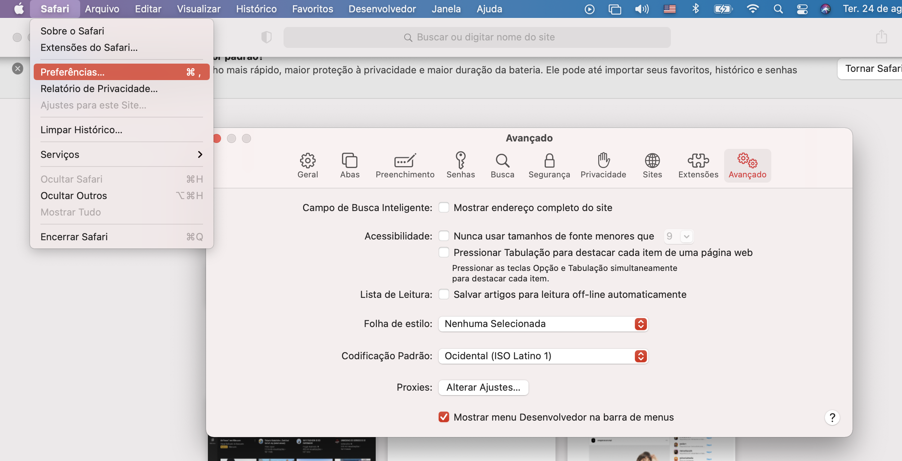
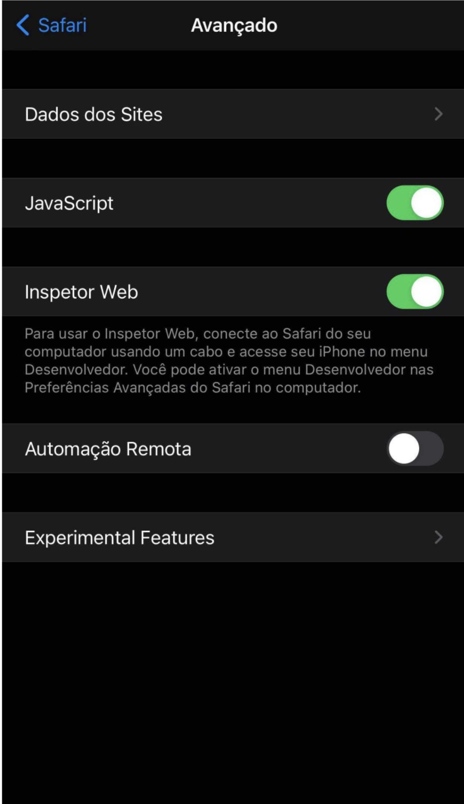
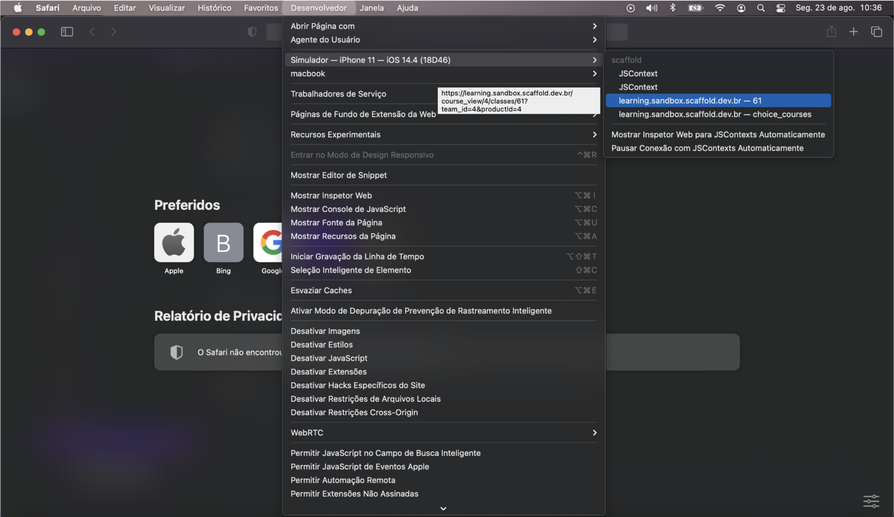
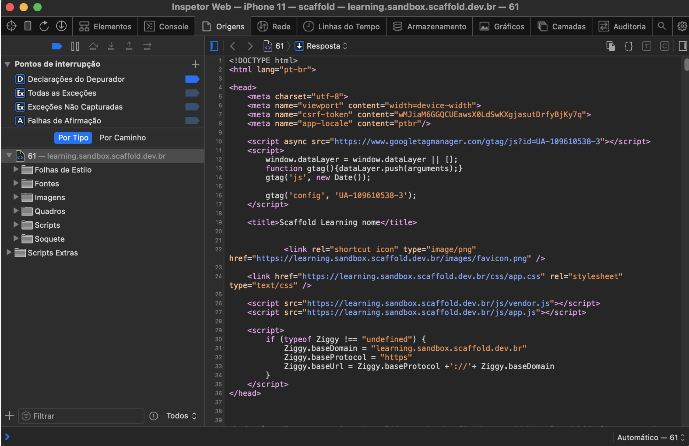
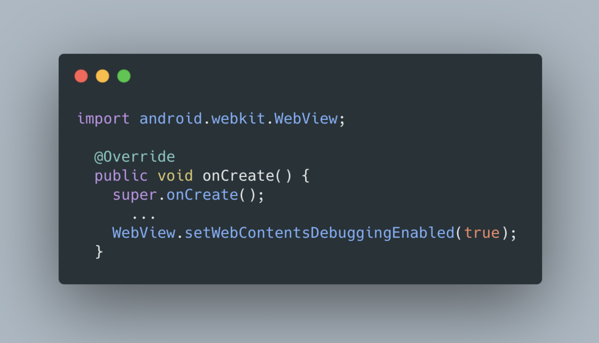
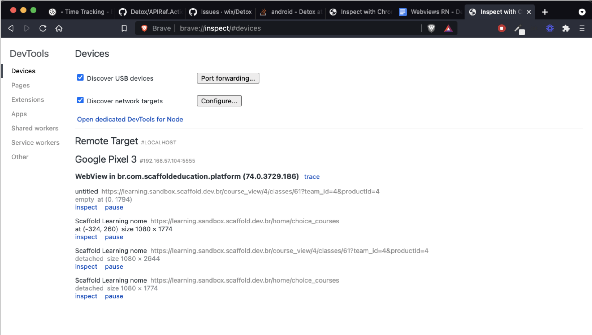
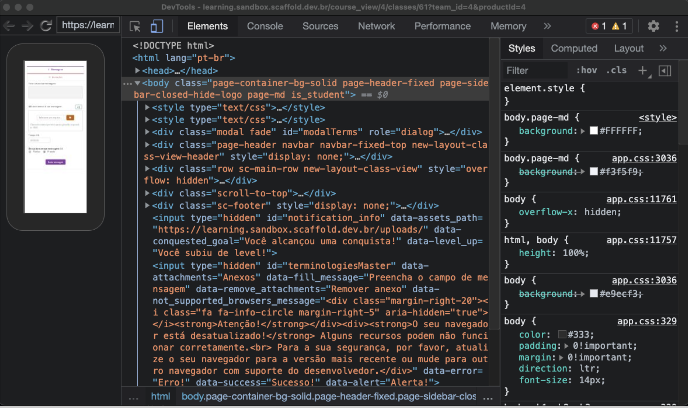

# WebView Debugging

## &nbsp;&nbsp;&nbsp;&nbsp;&nbsp; Introdução

&nbsp;&nbsp;&nbsp;&nbsp;&nbsp; Como forma de auxiliar no processo de desenvolvimento de aplicativos que utilizam internamente webviews, independente da tecnologia utilizada, este material foca no processo de debugging destas implementações, tendo em vista suas dificuldades e desafios dentre os quais muitas das vezes não possuímos nenhum controle da execução do código e alguns comportamentos que ocorrem na própria webview. Abaixo estão discriminadas em tópicos as configurações.

## &nbsp;&nbsp;&nbsp;&nbsp;&nbsp; iOS

&nbsp;&nbsp;&nbsp;&nbsp;&nbsp; Para debugar webviews no ambiente de desenvolvimento OSX, seja em um aplicativo executando em dispositivo físico ou emulador, faz-se necessário o uso do navegador Safari. Para isto, deve-se seguir os seguintes passos:

* **Abrir o Safari > Acessar Preferências > Avançado > Habilitar o checkbox "Mostrar menu Desenvolvedor na barra de menus"**

* Abrir o aplicativo com a webview, seja no emulador ou no dispositivo físico.
  * Para debugar no dispositivo físico, o Web Inspector deve estar habilitado. Para isto vá em **Configurações > Safari > Avançado > Web Inspector**

 
 

* **Voltar no Safari > Desenvolvedor > [Nome do dispositivo] > [Nome do App] > [URL -título]**

  * Se estas informações não forem exibidas como na imagem acima, provavelmente o Safari estava aberto antes do app, então basta reiniciar o Safari.

* O debugger é bem parecido com o debugger que estamos acostumados a utilizar para aplicações web front-end.

## &nbsp;&nbsp;&nbsp;&nbsp;&nbsp; Android

&nbsp;&nbsp;&nbsp;&nbsp;&nbsp; Para debugar webviews em ambientes de desenvolvimento Android (Windows, Linux, OSX) seja no emulador ou em um dispositivo físico, algumas configurações no próprio aplicativo se fazem  necessárias, dentre elas:

* No arquivo **MainApplication.java**, adicione as seguintes linhas, e re-compile o aplicativo.

* Acesse o endereço **chrome://inspect#devices**, selecione a opção inspect do dispositivo que possui o aplicativo com a webview. No caso, para quem utiliza algum navegador diferente do Chrome, a rota de inspect é diferente, como neste caso com o uso do Brave browser.

* O debugger além das ferramentas básicas do debugger padrão do navegador, possui também uma visualização "embedada" da webview que está sendo acessada.

